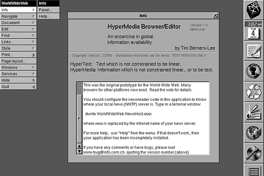
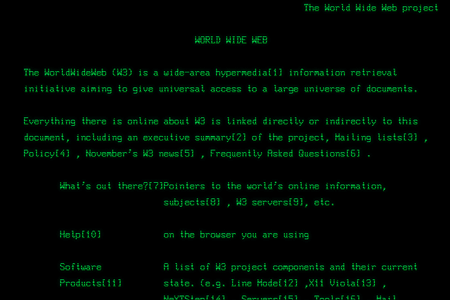
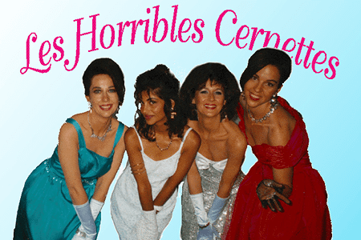
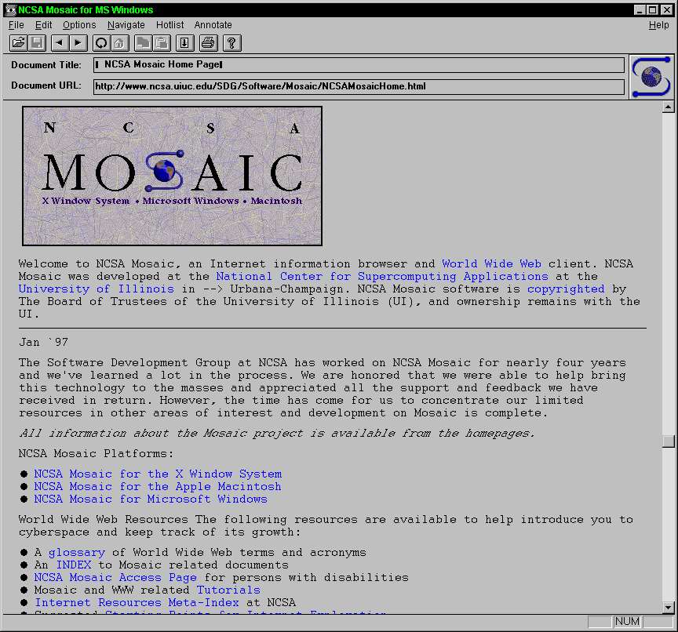
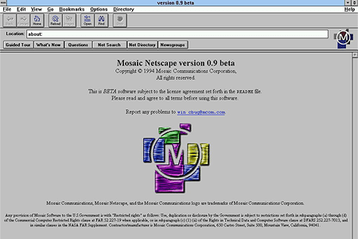

# 发展历史

>  🚧 WIP

本文将按照年份介绍web技术/架构/设计的发展历史。

## 80年代

### 1989

- 英国科学家[Tim Bernes-Lee](https://en.wikipedia.org/wiki/Tim_Berners-Lee) 发明了万维网 (Word Wide Web, 简称 Web)，其中有三项关键技术
  - 统一资源标志符 URI - **U**niform **R**esource **I**dentifier
  - 超文本标记语言 HTML - **H**yper**T**ext **M**arkup **L**anguage
  - 超文本传输协议 HTTP - **H**yper**T**ext **T**ransfer **P**rotocol

当时，Internet 上流行 [Gopher](https://en.wikipedia.org/wiki/Gopher_(protocol)) 协议，所以 Web 提出的头几年并没有立即流行，人们也没有意识到 Web 比 Gopher 更好。

## 90年代

### 1990

- Tim Bernes-Lee 编写了[第一个网页](http://info.cern.ch/hypertext/WWW/TheProject.html)，制作了[第一个浏览器与网页编辑器](https://www.w3.org/People/Berners-Lee/WorldWideWeb.html)(一开始叫`WorldWideWeb`，为了避免混淆改名为`Nexus`)

  

### 1991

- Tim Bernes-Lee 的团队制作了了第二个浏览器 **Line Mode Browser**.

    

- Tim Bernes-Lee 创建了 [第一个网站](http://info.cern.ch/hypertext/WWW/TheProject.html)，建立了第一个网站索引

- Tim Bernes-Lee 发布了一份包含对各个 HTML 标签的说明的[网页](https://www.w3.org/History/19921103-hypertext/hypertext/WWW/MarkUp/Tags.html)

- Tim Bernes-Lee 创建了 HTTP 的[第一个协议设计](https://www.w3.org/Protocols/HTTP/AsImplemented.html)，称为 HTTP v0.9 。彼时的 HTTP 协议十分简单，只包含了带文件名的 GET 请求。

此时的 Tim Bernes-Lee 在 Internet 上努力推广自己所设计的 Web 并有所成效。美国的第一个 Web 服务器也是在这一年诞生于SLAC国家加速器实验室。

### 1992

- Pei-Yuan Wei (魏培源，中国台湾人)在伯克利开发了第一个支持脚本，表格渲染和表格的浏览器 ——[ViolaWWW](http://viola.org/)。当时他还是个学生。👍

- Web 上第一次出现图片，这时候的图片只能显示在一个单独的窗口。了解过 web 历史的人应该都知道 Les Horribles Cernettes 的这张照片。ps. 这张照片上传前经过了 Photoshop 的处理。

  

### 1993

- 欧洲核子研究组织 宣布万维网对任何人免费开放，不收取任何费用

- 对 Web 发展起到极大作用的浏览器 **Mosaic** 在 NCSA 诞生。Mosaic 支持将图片嵌入网页等特性，更重要的是它可以免费使用。在它推出后，Web 迅速地流行了起来。

  

### 1994

- Jerry Yang (杨致远) 和 David Filo 创建了一个网站索引，后来改名为雅虎。当时他们还在斯坦福读博。

  

- Tim Berners-Lee 创建了万维网联盟 W3C。该联盟的主要目标是制定 Web 标准。

- Martijn Koster 提出 robots.txt 标准，通过设定规则用于防止或限制索引爬虫访问网站。*防君子不防小人*。

- 又一个十分重要且流行的浏览器 Netscape 诞生。它的开发者很多来自 Mosaic 项目组。虽然正式版本是收费的，但是评估版可以免费下载使用，又因为它功能丰富而且更新快，所以迅速占据了大量的市场份额。

  

  

### 1995

从 1994 年年末开始， Web 迎来了快速发展。

- Opera 推出，这是第一个支持同时打开多个网页窗口的浏览器。
- Netscape 推出 2.0 版本。微软推出 IE 浏览器（当时整个浏览器的大小只有1M）。历史上著名的[第一次浏览器大战](https://en.wikipedia.org/wiki/Browser_wars)拉开帷幕。
- Rasmus Lerdorf 发布了世界上最好的语言 —— PHP  `Personal Home Page` 的第一个版本 PHP/FI . 顾名思义，它专为个人主页开发而生，提供了快速开发动态 Web 程序的能力。然而当时 PHP 还有很多不完善的地方，因此 PHP 真正的崛起是在 1997 年 PHP3 推出之后。
- 拍卖网站 AuctionWeb 上线，也就是后来的 eBay.
- 电商巨头 Amazon 上线，标志着现代意义上的电子商务诞生。
- HTML 可视化编辑器 FrontPage 和 Adobe PageMill 相继推出，降低了网页编写的技术门槛，不会写代码的人也能快乐地画网页了。
- 永远的神——`Javascript` 在 Netscape 上诞生。
- IETF 发布了针对 HTML 2.0 的 RFC 1866 规范。HTML 开始支持表单，表格，图形等新元素。

 

> 从 1995 往后的 Web 发展历史我会更偏向于从技术角度阐述。